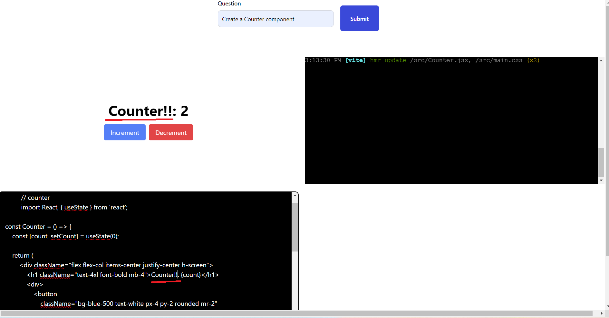

# AI Code Assistance

- This is a simple POC, where I have tried to built a simpler version of, [bolt.new](https://bolt.new/), which is a browser based dev sandbox powered with AI.
- My version is not super pretty but functional and working demo.
- I was fascinated by how `bolt` worked and since it was open source so I looked into the repo.
- It opened up my mind to some new frameworks and I was excited to try it out myself.
- This POC:
  - lets user ask the AI to generate a React component
  - Read and Update the code of the generated component in the text area.
  - Interact with the Rendered component in a iFrame.

## Internal Working

- This is a simple NextJs App with a FE to render the UI and a BE route to integrate with the LLM.
- Let's look at FE and BE individually:

  - Backend

    - I have a simple route `/api/ask` that takes in the user question and returns a list of component code.
    - Since it's a chat bot style flow, to manage the messages I have used two functions `convertUIMessageToLangChainMessage` and `convertLangChainMessageToUIMessage` that converts the messages from LangChain format to what UI can understand and vice versa.

    ```js
    // UI format
    const uiMessages = [
      {
        content: "Hello",
        role: user,
      },
    ];
    // LangChain format message
    const langchaninMessages = [new HumanMessage("Hello")];
    ```

    - For integrating with the LLM I have a simple chain

    ```ts
    // JSON format I want the LLM output to be in
    type File = {
      content: string;
      language: string;
      name: string;
    };
    // JSON parser to format AI output in certain JSON format
    const parser = new JsonOutputParser<File[]>();
    const llm = new ChatOpenAI({
      model: "gpt-4o-mini",
      temperature: 0,
    });

    const chain = promptTemplate.pipe(llm).pipe(parser);
    ```

    - The `promptTemplate` is where we provide instruction to the LLM on what role we want it to take and how to respond.

  - FrontEnd

    - The UI is simple it has a `form` that contains the button and input element.
    - The user types in the question and submits, which then calls the BE API.
    - The real magic happens once the response from the BE is returned.
    - I had to parse, compile and then render it on an iFrame.
    - For all of it I used a fancy library called `@webcontainer` by amazing `stackblitz` to render and compile the content and for the terminal I have used `@xterm`.
    - The `@webcontainer` library uses `WebContainer API`, which is a browser-based runtime for executing Node.js applications and operating system commands.
    - The main crux is the `files` format that gets mounted into the container. That's how we tell the container about our file system.
    - Here is an example of a `index` file to run a node server

    ```js
    export const files = {
      "index.js": {
        file: {
          contents: `
            import express from 'express';
            const app = express();
            const port = 3111;
    
            app.get('/', (req, res) => {
                res.send('Welcome to a WebContainers app!!!! 🥳');
            });
    
            app.listen(port, () => {
                console.log(\`App is live at http://localhost:\${port}\`);
            });`,
        },
      },
    };
    ```

    - Each file in our file system is a new key value pair in the `files` object.
    - I have used a `vite` based skeleton to compile and render the content returned by the LLM.
    - So you will notices that the `files.js` in my case has certain predefined files that are needed for a `vite` app to bootstrap and run.
    - The actual code is what the LLM returns and I have a function to add it to the `files` object and create the required textArea to render them.

    ```ts
    // sample code
    // loop over the ids extracted from the llm response
    ids.forEach((id) => {
      // find the object from the resposne to extract content
      const fileData = filesNeeded.filter((d) =>
        d.name.toLocaleLowerCase().includes(id)
      );
      // append the content to the files object under src directory
      files["src"]["directory"][fileData[0].name] = {
        file: {
          contents:
            id == "main"
              ? `
            import "./main.css"; \n
            ${fileData[0].content}
            `
              : fileData[0].content,
        },
      };

      if (id !== "main") {
        const textareaEl = document.getElementById(id)! as HTMLTextAreaElement;
        // load content in textarea
        textareaEl.value = `
            // ${id}
            ${fileData[0].content}
            `;

        // add event listener to change for text area
        const filePath = `src/${fileData[0].name}`;
        textareaEl.addEventListener("input", (e: Event) => {
          writeIndexJS(
            webContainer,
            filePath,
            (e.currentTarget as HTMLInputElement).value
          );
        });
      }
    });
    ```

## Local Development

**_ Note _** please update the OPEN AI key in the `.env.local` file

- To try out the app locally, run the following commands:
  - `npm install` - this will install the required deps.
  - `npm run dev` - this will start the local dev server.

## UI



